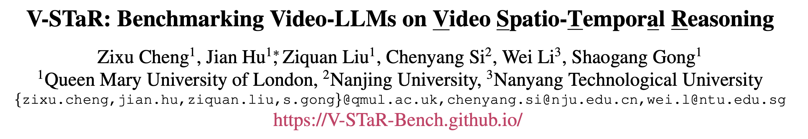
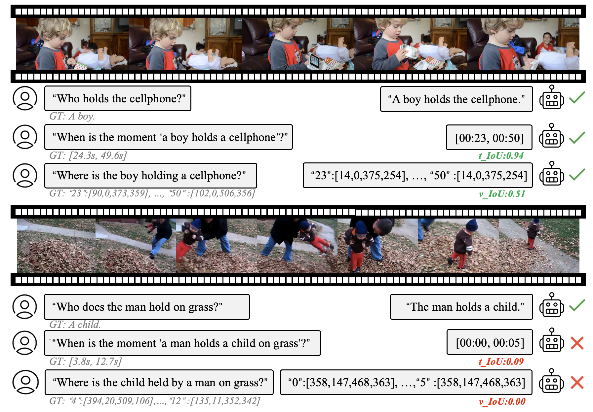
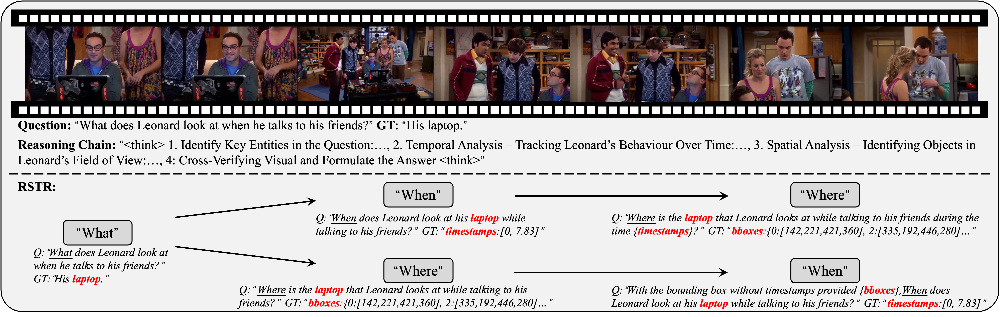
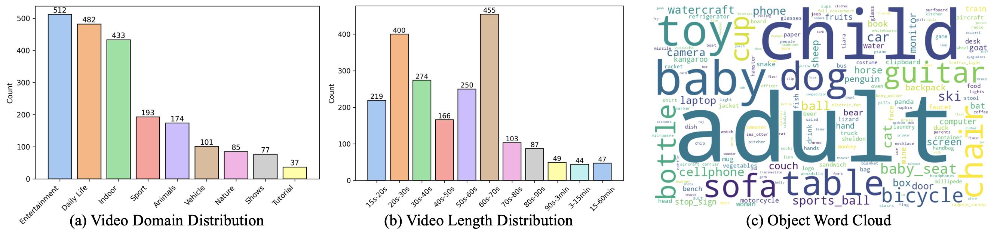
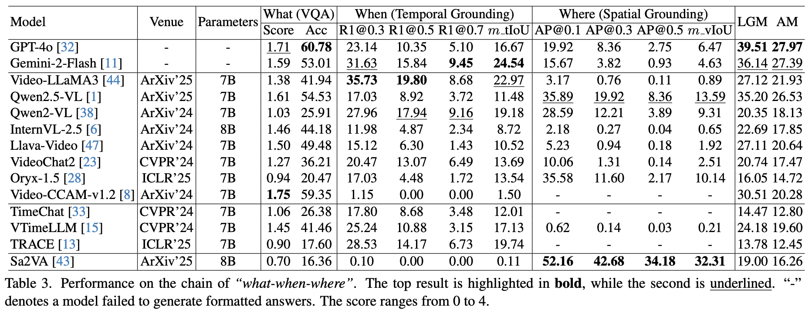
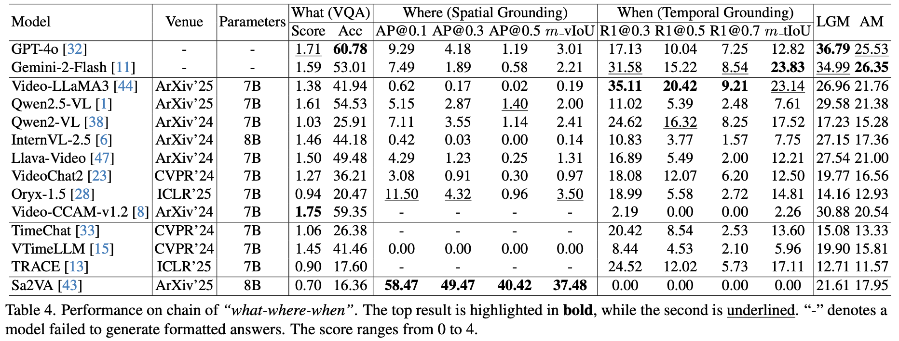
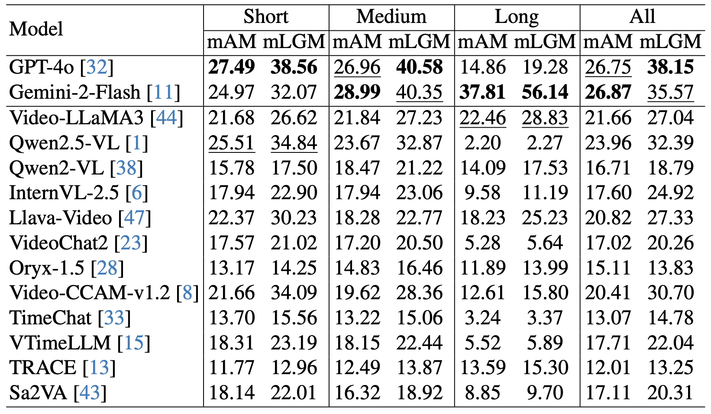
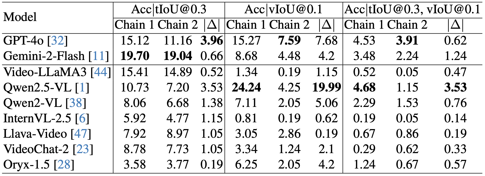
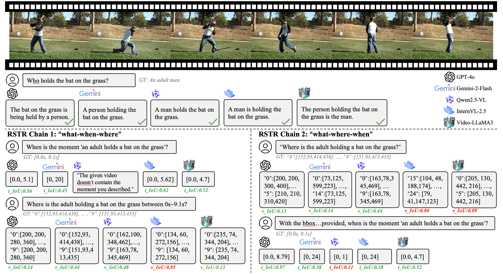

# 大模型能像人一样推理视频时空吗？首个视频时空推理能力评测基准V-STaR推出

**TL;DR:** 正确利用视频时空进行推理是通往通用人工智能的关键。人在理解视频内容的时候，通常利用了视频中时间和空间的关系（“when-where dependencies”）进行推理出问题的答案（“what”）。当前的评测基准通常只探究模型是否能正确回答问题（“what”）而没有探究模型是否利用了正确的时间（“when”）和空间（“where”）内容进行推理，我们不知道视频大语言模型（Video-LLMs）是否具有这样的时空推理能力，还是利用了预训练的共现关系偏差来推理的答案。为此，伦敦玛丽女王大学联合南京大学、南洋理工大学提出首个视频时空推理评估基准，V-STaR（Benchmarking Video-LLMs on Video Spatio-Temporal Reasoning）。

V-STaR 拥有充足且灵活可变的视频长度、包含多种视频领域、丰富的时间和空间标注，全面地探索模型是否利用正确的时空内容进行推理回答。通过对 14 个最新流行的视频大语言模型评测发现，排名第一的 GPT-4o 只有不到5%的回答正确利用了时空推理能力，揭示了现有模型在视频时空推理能力上仍然面临重大挑战。我们的研究还探讨了时间和空间的不同顺序对大模型时空推理能力的影响，期待 V-STaR能够推动社区对视频时空推理研究的发展。

**论文标题：** V-STaR: Benchmarking Video-LLMs on Video Spatio-Temporal Reasoning

**论文链接：** https://arxiv.org/abs/2503.11495

**项目链接：** https://github.com/V-STaR-Bench/V-STaR

## 1. 背景介绍

视频大语言模型的研究中取得了极大的进展，在当前流行的视频理解评测基准中[1,2,3]不断刷新成绩。然而，我们不知道模型是否具有像人一样的时空推理能力，还是利用了预训练的共现关系偏差来推理的答案。当前研究社区仍然缺乏全面和有效的时空推理评估基准，主要存在以下问题：

- **缺乏完整的时空推理的探索** ：当前流行的 Video Benchmark[1,2,3]主要针对视频问答设计，没有探索模型是否利用了正确的视频时空内容进行推理回答；
- **忽视时空推理与问答的关系** ：一些数据集对待时空推理与问答为独立的子任务[4, 5]，未能衡量模型的时空逻辑推理能力；
- **忽视了错误传播的问题** ：现有的评测基准[6,7,8,9]忽视了模型推理过程中发生错误导致最终结果错误的问题，无法公平且独立地分析模型的时间和空间推理能力；

## 2. V-STaR的构建过程

针对以上不足，我们提出了 V-STaR：首个全面的视频时空推理 Benchmark。V-STaR 具有以下特点：

1. 完整的时空推理的探索

   V-STaR提出了 RSTR （Reverse Spatio-Temporal Reasoning） 任务，同时评估模型在哪些目标存在（“what”）、事件何时发生（“when”）以及目标位于何处（“where”）等方面的输出，还可检查模型在推理过程中如何构建推理逻辑链。RSTR任务以模型是否能够正确回答“what”问题为基础，反推模型是否利用了正确的时间（“when”）和空间（“where”）内容进行推理。为了全面探索时空推理与问答的关系，RSTR设计了2个推理任务链：“what-when-where”和“what-where-when”，以研究不同的逻辑推理顺序对最终结果的影响。

2. 独立评估模型的时间和空间推理能力：

   为了模型推理中错误传播的问题，RSTR设计了推理任务链。在任务链中，后一个问题都包含了前一个问题的答案。例如在“what-when-where”推理链中，“when”问题会包含“what”问题的答案，“where”会包含“what”和“when”问题的答案，以此避免模型在“what-when-where”推理链中出现错误传播，导致的不公平的时间和空间推理能力评估。

3. 涵盖丰富的视频场景、长度和丰富的时空标注：

   V-STaR 构建了2094个样本，视频种类涵盖了9大场景，包含短中长视频，时长覆盖了 从15 秒到大约 1 小时，更好地反映真实世界的场景。另外，V-STaR 的时间片段标注平均占视频总长度的19.3%，空间标注平均占视频分辨率的19.8%，保证了V-STaR 时空推理任务的难度。

## 3. Video-LLMs在V-STaR上的表现

我们在 V-STaR 上对 14个流行的 MLLM 进行了评测，包括开源模型和闭源模型。我们提出利用新的指标LGM（Logarithmic Geometric Mean）和AM（Arithmetic Mean）来评估模型的时空推理能力，我们根据 视频问答的 “准确度”、时间定位的 “m_tIoU ”和空间定位的 “m_vIoU ”计算 AM 和 LGM，并根据我们提出的 2 个 RSTR 任务链的结果得出平均 AM（mAM）和平均 LGM（mLGM）。评测结果如下：

“what-when-where”任务链的评估结果：

“what-where-when”任务链的评估结果：

在不同视频长度下的结果（Short:0\~1min, Medium:1\~3min, Long:3\~60min）：

联合表现结果：

实验结果发现：

1. 正确的视频时空推理对模型仍具有挑战。尽管 GPT-4o[10]在LGM指标上取得了第 1 名的成绩，然而在时间与空间推理任务上的性能与视频问答相比大幅下降，在“what-when-where”任务链中仅仅只有4.53%的回答正确利用了时空推理能力。这表明模型并没有能利用正确的视频时空内容对视频问答进行推理。此外，大部分模型的时空推理性能都会随着视频时长增加显著下降。
2. 不同模型擅长不同的时空推理链。在两个不同的RSTR推理任务链中，大部分模型都在“what-when-where”任务链中取得更好的结果，说明大部分模型更擅长先时间后空间的顺序进行推理，少数模型（如Sa2VA[11]）会在另一个任务链“what-where-when”上结果更好。

## 4. 结论

我们提出了一个新的能力评测基准V-STaR，它是第一个用于全面评估视频大语言模型时空推理能力的基准。我们构建了一个包含从粗粒度（“what”）到细粒度（“when” and “where”）RSTR任务链的数据集，并引入了一个新的对数几何平均（LGM）指标用于结构化评估视频时空推理性能。我们对 14 个视频大语言模型的实验，深入了解了它们的时空推理能力和未来改进方向。

附：V-STAR的定性分析结果

参考链接：

[1] Kunchang Li, Yali Wang, Yinan He, Yizhuo Li, Yi Wang, Yi Liu, Zun Wang, Jilan Xu, Guo Chen, Ping Luo, et al. Mvbench: A comprehensive multi-modal video understanding benchmark. In Proceedings of the IEEE/CVF Conference on Computer Vision and Pattern Recognition, pages 22195– 22206, 2024.

[2] Xinyu Fang, Kangrui Mao, Haodong Duan, Xiangyu Zhao, Yining Li, Dahua Lin, and Kai Chen. Mmbench-video: A long-form multi-shot benchmark for holistic video understanding. Advances in Neural Information Processing Systems, 37:89098–89124, 2025.

[3] Chaoyou Fu, Yuhan Dai, Yongdong Luo, Lei Li, Shuhuai Ren, Renrui Zhang, Zihan Wang, Chenyu Zhou, Yunhang Shen, Mengdan Zhang, et al. Video-mme: The first-ever comprehensive evaluation benchmark of multi-modal llms in video analysis. arXiv preprint arXiv:2405.21075, 2024.

[4] Yunxin Li, Xinyu Chen, Baotian Hu, Longyue Wang, Haoyuan Shi, and Min Zhang. Videovista: A versatile benchmark for video understanding and reasoning. arXiv preprint arXiv:2406.11303, 2024.

[5] Ye Liu, Zongyang Ma, Zhongang Qi, Yang Wu, Ying Shan, and Chang Wen Chen. Et bench: Towards open-ended event-level video-language understanding. arXiv preprint arXiv:2409.18111, 2024.

[6] Leonard Barmann and Alex Waibel. Where did i leave my ¨ keys?-episodic-memory-based question answering on egocentric videos. In Proceedings of the IEEE/CVF Conference on Computer Vision and Pattern Recognition, pages 1560– 1568, 2022.

[7] Junbin Xiao, Angela Yao, Yicong Li, and Tat-Seng Chua. Can i trust your answer? visually grounded video question answering. In Proceedings of the IEEE/CVF Conference on Computer Vision and Pattern Recognition, pages 13204– 13214, 2024.

[8] Jr-Jen Chen, Yu-Chien Liao, Hsi-Che Lin, Yu-Chu Yu, YenChun Chen, and Frank Wang. Rextime: A benchmark suite for reasoning-across-time in videos. Advances in Neural Information Processing Systems, 37:28662–28673, 2025.

[9] Jie Lei, Licheng Yu, Tamara Berg, and Mohit Bansal. Tvqa+: Spatio-temporal grounding for video question answering. In Proceedings of the 58th Annual Meeting of the Association for Computational Linguistics, pages 8211–8225, 2020. 

[10] OpenAI. Gpt-4o. https://openai.com/index/hello-gpt-4o/, 2024.

[11] Haobo Yuan, Xiangtai Li, Tao Zhang, Zilong Huang, Shilin Xu, Shunping Ji, Yunhai Tong, Lu Qi, Jiashi Feng, and Ming-Hsuan Yang. Sa2va: Marrying sam2 with llava for dense grounded understanding of images and videos. arXiv preprint arXiv:2501.04001, 2025.
